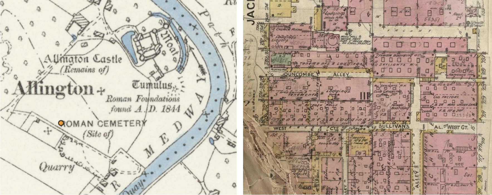

# Beyond Labels: computational approaches to text on maps

**Panel 1**: Maps to the Past. Open digital approaches to the investigation of historical maps.

- **Valeria Vitale** 
    - The Alan Turing Institute. London
    - [vvitale@turing.ac.uk](mailto:vvitale@turing.ac.uk)
    - @nottinauta
- **Katherine McDonough**
    - The Alan Turing Institute. London
    - [kmcdonough@turing.ac.uk](mailto:kmcdonough@turing.ac.uk)
    - @khetiwe24
- **Rainer Simon**
    - Austrian Institute of Technology
    - [Rainer.Simon@ait.ac.at](mailto:Rainer.Simon@ait.ac.at)
    - @aboutgeo
- **YaoYi Chiang**
    - University of Minnesota
    - [yaoyi@umn.edu](mailto:yaoyi@umn.edu)
    - @YaoYiChiang1
- **Zekun Li**
    - University of Minnesota
    - [li002666@umn.edu](mailto:li002666@umn.edu)
- **Jina Kim**
    - University of Minnesota
    - [kim01479@umn.edu](mailto:kim01479@umn.edu)
    - @jina_kimmm
- **Deborah Holmes-Wong**
    - University of Southern California Library
    - [dhwong@usc.edu](mailto:dhwong@usc.edu)

Machines Reading Maps (MRM) aims to make digitised maps more accessible and usable, while generating a new kind of historical research data. MRM uses machine learning (ML) to detect and transcribe map text. Unique named entities are also automatically linked to external knowledge bases such as WikiData. Identifying and linking place names enriches maps semantically and generates more granular metadata, making maps more findable as objects in a collection, and their contents more “searchable” by users. The value of map text, though, is not merely literal, and MRM application of automated techniques highlights the polysemy of words on maps as both labels (communicating the place name) and symbols (communicating information through size, position, orientation and font.

To capture the different roles that map text performs, MRM developed a customised version of the semantic annotation platform Recogito. The manual annotation process was aimed at creating a gold standard for evaluating ML tasks, but it quickly became a valuable tool for reflecting on the ways in which map text is used, and how we might represent it in structured data. In particular, we decided to focus on “peripheral signification” (Schlichtmann, 2018), i.e. the kind of information that is not intentionally included by the cartographer but can, nonetheless, be inferred by the map user, especially in a diachronic perspective. Looking at text labels, we are investigating modes of delivering these “accidental” meanings on map series, and attempt to make them algorithmically detectable.

We focused on two case-studies, in two map series which were published in multiple editions over time:

1.  The representation of antiquities on Ordnance Survey (OS) maps of Great Britain. These 19th-century, large-scale maps capture a high number of historical and archaeological sites. Different fonts were used to identify historical periods, and a codified vocabulary was employed to provide information about the site’s status and interpretation. We are analysing their distribution, cartographic selection, the linguistic evolution of the text labels, and the relationship with current archeological data. Last, we investigate “peripheral” information about the connotations associated with these antiquities at the time the maps were produced.
    
2.  The representation of minority and immigrant communities on mid 19th-20th-century Sanborn Fire Insurance Maps, which records rich information at building level for about 12,000 US cities. In order to assess fire risk, the surveyors produced, almost accidentally, a wealth of information about the urban experience of marginalised groups over time. Areas that are labelled as “negro”, “chinese” or “italian” on the maps offer glimpses into the everyday life of those communities, “accidentally” showing patterns in the representation of minority experience over time and dramatic structural changes in the urban fabric that disrupted community life (e.g. redevelopment or arson).

**License**
Left: Ordnance Survey Map, 6 inch. CC-BY (National Library of Scotland)

Right: Sanborn Fire Insurance Map. Detail of Los Angeles. CC-BY NC SA. David Rumsey Map Collection, David Rumsey Map Center, Stanford Libraries