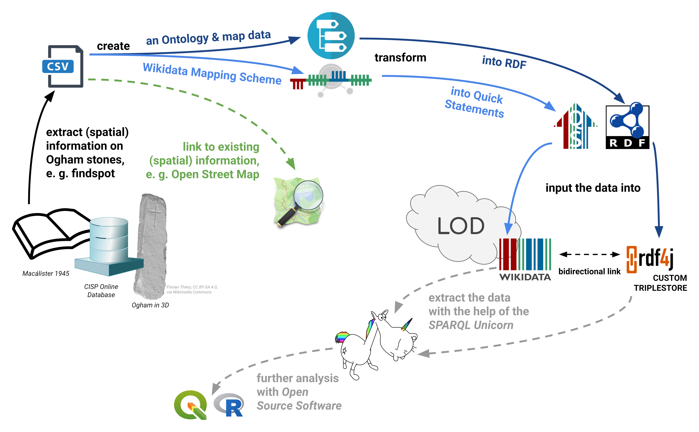

**Challenges in research community building**

# Challenges in research community building: integrating Terra Sigillata (Samian) Research into the Wikidata community

**Panel 3**

Panel 3 - I/O: ethics, policies and technologies for programmatic and open access to archaeological online data sets

**Authors**

-   **Florian Thiery**
    -   Research Squirrel Engineers Network, Mainz, Germany
    -   Römisch-Germanisches Zentralmuseum, Mainz, Germany
    -   <mailto:mail@fthiery.de>
    -   [@OghamFPFW](https://twitter.com/OghamFPFW)
    -   [Website](https://ogham.link)
    -   ORCID: [0000-0002-3246-3531](https://orcid.org/0000-0002-3246-3531)
    -   Wikidata: [Q66606154](http://www.wikidata.org/entity/Q66606154)
    -   GitHub: [@ogi-ogham](http://github.com/ogi-ogham)

**Proposal text**

The [Linked Open Ogham Data Project](https://ogham.link) was set up in 2019 by the [Research Squirrel Engineers Network](https://squirrel.link) as a non-institutional funded use case which was finally supported by the Wikimedia Germany [Open Science Fellows Program](https://en.wikiversity.org/wiki/Wikimedia_Deutschland/Open_Science_Fellows_Program) in [2020/2021](https://de.wikiversity.org/wiki/Wikiversity:Fellow-Programm_Freies_Wissen/Einreichungen/Irische_%E1%9A%91%E1%9A%8C%E1%9A%86%E1%9A%90%E1%9A%8B_(Ogham)_Steine_im_Wikimedia_Universum). It aims at providing and integrating Ogham Data in community hubs[3-5]. Ogham stones are Early Mediaeval stones inscribed with the Ogham script created between the 6th and 9th centuries AD. The texts found on Ogham Stones mostly refer to persons, tribes, or family affiliations. Since graphs rely on linking statements between entities to form a network, this corpus is especially well-suited to being represented in a graph. This results in the sense of comprehensible and FAIR data in the RDF standard and Linked Open Data (LOD). Ogham Stones are mentioned in several catalogues such as books (e.g. Corpus inscriptionum Insularum Celticarum (CIIC)[1], A Guide to Ogam[2], The Iveragh Peninsula[7]), “Online-Databases” (e.g. Celtic Inscribed Stones Project, [CISP](https://www.ucl.ac.uk/archaeology/cisp/database/)) or online repositories (e.g. [Ogham in 3D](https://ogham.celt.dias.ie)).

The hybrid Ogham LOD workflow is based on the idea of Open Science, Open Software, Open Data and the FAIR Principles to create re-usability and a modular IT-infrastructure with community-standards and commonly-used interfaces. The origin data will be digitised and transformed into CSV. In a data-driven approach data modelling schemes (an [Ontology](https://doi.org/10.5281/zenodo.4407344) and Wikidata Mapping Scheme) are created to transform the data into RDF or Quick Statements using Python Scripts to allow iterations. The resulting data is then ready to import into a RDF4J Triplestore and Wikidata. The [data](https://github.com/ogi-ogham/ogham-datav1) is stored and also published together with the scripts on GitHub, with a direct connection to [Zenodo](https://doi.org/10.5281/zenodo.4765603). With this Open Data and Open Research Software approach, citability and reproducibility by using GitHub and Zenodo with DOIs and CFF File is ensured; in Wikidata a [Project Page](https://www.wikidata.org/wiki/Wikidata:WikiProject_Irish_Ogham_Stones) is used for documentation.

With the use of Open Source technologies and community standards such as RDF and Quick Statements, Ogham Data is available in several variants: (i) as LOD in RDF in a RDF4J triplestore with a SPARQL endpoint and (ii) inside Wikidata with its SPARQL query interface and its APIs. Additionally, lightweight JavaScript Web Applications, aka Little Ogham Minions[6], are created to showcase the Ogham LOD: (iii) the [Reference Viewer](http://ref.ogham.link) to find similar catalogue numbers (e.g. O’Sullivan[7], [p.908](http://ref.ogham.link/?node=osullivan_1996:908)), and (iv) the [Ogham Lookup Tool](http://lookup.ogham.link) to visualise the findspots on an interactive map.

Nevertheless, this concept and architecture causes problems in IT sustainability and hosting of resources as for all non-institutional funded projects. The data can be maintained by archaeologists or Citizen Scientists GitHub PRs and Wikidata edits and is connected via bidirectional links between LOD and Wikidata. But how can we solve the IT challenges? In the Ogham case we try to use the “Squirrel Power” and the Research Squirrel Engineers Network to create a community of enthusiasts and looking forward.

**References**

-   [1] Macalister, Robert Alexander Stewart. 1945. Corpus Inscriptionum Insularum Celticarum. Vol. I. Dublin: Stationery Office.
-   [2] MacManus, Damian. 1997. A Guide to Ogam. Maynooth Monographs 4. Maynooth: An Sagart.
-   [3] Schmidt, Sophie C., and Florian Thiery. 2022. ‘SPARQLing Ogham Stones: New Options for Analyzing Analog Editions by Digitization in Wikidata’. CEUR Workshop Proceedings 3110 (Graph Technologies in the Humanities 2020): 211–44. DOI: 10.5281/zenodo.6380914.
-   [4] Bogdani, Julian, Riccardo Montalbano, and Paolo Rosati. 2021. ArcheoFOSS XIV 2020: Open Software, Hardware, Processes, Data and Formats in Archaeological Research. Oxford: Archaeopress Publishing Ltd: 119–127.
-   [5] Thiery, Florian, Timo Homburg, Sophie C. Schmidt, Jakob Voß, and Martina Trognitz. 2021. ‘SPARQLing Geodesy for Cultural Heritage – New Opportunities for Publishing and Analysing Volunteered Linked (Geo-)Data’. In FIG Peer Review Journal. Vol. FIG Peer Review Journal: FIG e-Working Week 2021 – Virtually in the Netherlands 21-25 June 2021. Kopenhagen: FIG. DOI: 10.5281/zenodo.5639381.
-   [6] Thiery, Florian. 2021. ‘My Little Linked Open Data Ogham Minion: Visualising Graph Data Connections Using SPARQL Endpoints’. Presented at the Computer Applications and Quantitative Methods in Archaeology, online, June 16. DOI: 10.5281/zenodo.5846066
-   [7] O’Sullivan, Ann, and John Sheehan. 1996. The Iveragh Peninsula. An Archaeological Survey of South Kerry. Cork: Cork University Press.

**Image**

The hybrid Linked Open Data Ogham Workflow, Florian Thiery, Timo Homburg, Sophie C. Schmidt und Martina Trognitz, CC BY 4.0, via Wikimedia Commons

**Licence**

-   Text: CC BY 4.0, Florian Thiery
-   Image: CC BY 4.0, Florian Thiery, Timo Homburg, Sophie C. Schmidt und Martina Trognitz
