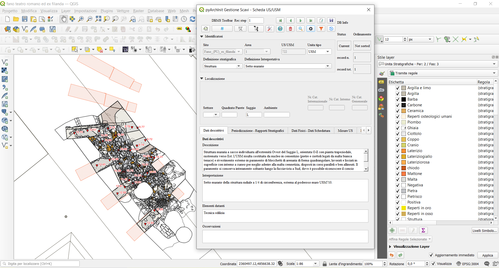

# The urban context of the roman theater and “ex Filanda” in Fano (PU)

**Panel 4**. GIS open source solution for archaeological context in between Universities, Public Administration, societies, research center: pyArchInit case.

- **Annalisa d’Onofrio**
  - adArte Srl, Rimini, Italy
  - [anasdon@gmail.com](mailto:anasdon@gmail.com)
- **Maria Raffaella Ciuccarelli**
  - SABAP Ancona e Pesaro Urbino, Ancona, Italy
  - [mariaraffaella.ciuccarelli@beniculturali.it](mariaraffaella.ciuccarelli@beniculturali.it)

This contribution will illustrate some of the main potential of the pyArchInit plugin, 
an open source tool created in python language for the management and overall analysis of 
archaeological data on a single georeferenced platform (QGIS). Through the display of a 
concrete field of research, some of the functionalities of the application will be highlighted 
in reference to the archaeostratigraphic survey conducted from February to May 2021 by adArte Srl, 
a company from Rimini, under the scientific direction of the Superintendence of Archeology, 
Fine Arts and Landscape for the provinces of Ancona and Pesaro and Urbino, within the area of 
the Roman theater and the former Bosone spinning mill, in the historic center of Fano (PU), in the Marche region.

Specifically, at the same time as the stratigraphic archaeological excavation operations by hand were 
carried out, we proceeded directly on site, with the detailed management of both the identified 
Stratigraphic Units and the materials recovered during the excavation, inserting all data within the 
various alphanumeric and geometric tables, present in the database. In this way, the entire documentary 
apparatus was developed using the functions and potential of the pyArchInit plugin which made it possible, 
once the insertion of all the excavation data was completed, to automatically generate not only the 
plans of the individual stratigraphic units but also those of phase and period, accompanied by the 
altimetric heights, as well as having the export of pdf files in ministerial format of all the 
individual cards (US cards, period cards, structure cards, finds cards, sample cards), of the various 
lists and of the stratigraphic diagram (matrix) with the details of the chronological phases.

In this way, together with the final report of the archaeological investigation conducted, 
it was possible to deliver to the reference Superintendency the entire package of georeferenced 
information layers in GAUSS BOAGA EST format (EPSG 3004), which can be easily interrogated and managed 
in the various public SITs and used with agile dynamism as tools of scientific research and 
planning for the protection of the territory.
