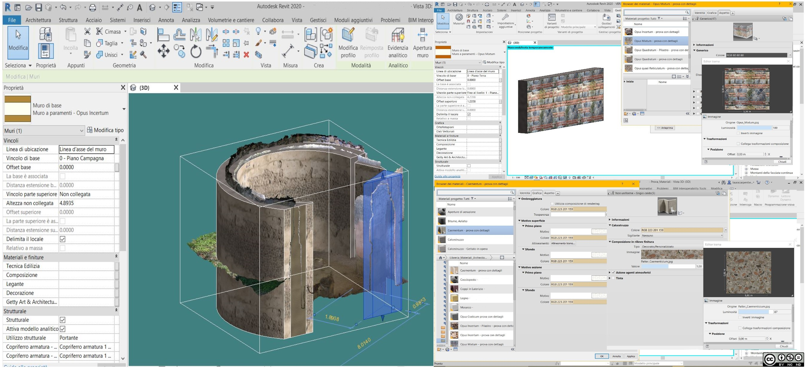

# Operative tools for BIM in archaeology: libraries of archaeological parametric IFC objects

**Panel 6**: Practice and Paradigms of Open Source Technologies for Archaeological Field Data.

Provide here as paragraph the name of the selected panel. The full list is available at [https://archeofoss.org/2022/call-for-papers](https://archeofoss.org/2022/call-for-papers)

- **Laura Carpentiero**
  - Università di Napoli L’Orientale, Napoli, Italy
  - [lcarpentiero@unior.it](mailto:lcarpentiero@unior.it)
- **Dora D'Auria**
  - Università di Napoli L’Orientale, Napoli, Italy
  - [ddauria@unior.it](mailto:ddauria@unior.it)

BIM, acronym for Building Information Modelling, is one of the most consolidated work methods for the engineering design of buildings and infrastructural works. It allows to create a comprehensive database starting from the 3D model of a building. This system represents an all-encompassing data platform where all the information related to the built work can be used like a basis for planning any management, maintenance and enhancement. 3D modelling is done through parametric objects, 3D representation of all those elements- structural, plant engineering and decorative - that make up a building. Each object must be correlated with records of a different nature (geometric, structural, etc.).

The use of BIM in archaeology allows to test and transform a working method born for engineering design, in a valid operational support for archaeologist during the field phase and after, in the data processing phase. By using Autodesks Revit software, it is possible to recreate the reality of the archaeological building by means of parametric BIM objects. Parametric objects and their interaction create the BIM model which constitutes a database, always updated and searchable by every professional working on the building.

An ideal case study to test the potential of BIM, as a model for managing an archaeological context, is represented by Pompeii. The extraordinary state of conservation of the ancient Vesuvian town and the wide variety of architectural types it offers, constitute an essential reference point for any research concerning Roman architecture of the republican and early-imperial periods. This is truth also when one means to assess the utility of using BIM information systems for the management of all types of documents (texts, pictures, drawings, 3D re-constructions) related to the ancient building, concerning both its study and conservation. The Pompeian context therefore represents a suitable field of experimentation, to evaluate how to turn a BIM information system into an efficient tool to support archaeological research, especially in the phases of data organization and interpretation. This aim can be reached by creating an Archaeological Semantic Library Model, exportable and including a range of parametric objects so wide and varied as to correspond to the set of elements that could be part of the 3D BIM model of a Roman building. For this purpose, libraries of archaeological parametric objects modelled ad hoc on Pompeian architecture have been created. These objects, completed of structural and compositional parameters, texturized on a real basis and completed of custom graphics, represent a support to share and use on a large scale the representation in BIM.

There is currently no free software for creating BIM models. Despite this, all the objects making up the Archaeological Library can be exported in the IFC format. This format can be opened and edited by all BIM modelling software and can be used on all OS.

**License**

Text and image are released under CC BY-ND-NC 4.0 International. Copyright Laura Carpentiero, Dora D’Auria 2022
