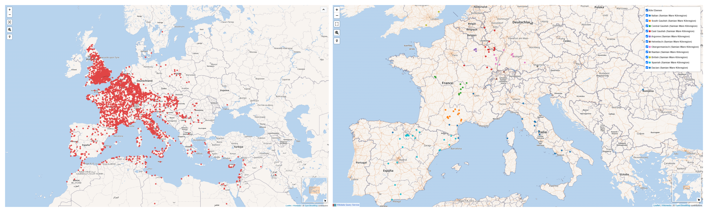

# Challenges in research community building: integrating Terra Sigillata (Samian) Research into the Wikidata community

**Panel 8**. From wiki projects to OpenStreetMap, collaborative approaches to open data creation: problems, case studies, territorial and cultural impact.

-   **Florian Thiery**
    -   Römisch-Germanisches Zentralmuseum, Mainz, Germany
    -   <mailto:florian.thiery@rgzm.de>
    -   [@fthierygeo](https://twitter.com/fthierygeo)
    -   ORCID: [0000-0002-3246-3531](https://orcid.org/0000-0002-3246-3531)
    -   Wikidata: [Q66606154](http://www.wikidata.org/entity/Q66606154)
    -   GitHub: [@florianthiery](http://github.com/florianthiery)
-   **Allard Mees**
    -   Römisch-Germanisches Zentralmuseum, Mainz, Germany
    -   <mailto:allard.mees@rgzm.de>
    -   ORCID: [0000-0002-7634-5342](https://orcid.org/0000-0002-7634-5342)
    -   Wikidata: [Q88865971](http://www.wikidata.org/entity/Q88865971)
    -   GitHub: [@AllardMees](http://github.com/AllardMees)
-   **John Brady Kiesling**
    -   ToposText.org, Athens, Greece
    -   <mailto:topostext@gmail.com>
    -   ORCID: [0000-0003-3281-5741](https://orcid.org/0000-0003-3281-5741)
    -   Wikidata: [Q4955198](http://www.wikidata.org/entity/Q4955198)

*Discovery sites (left; Q102202066) and kilns (Q102202026) clustered and colored by kiln regions (right) from Wikidata, queried by the Wikidata Query Service by <https://w.wiki/5BRk> and <https://w.wiki/4pKz> on 19/05/2022. CC0 (Public Domain), Wikidata Community, Wikimedia Foundation.*

The [RGZM](http://www.wikidata.org/entity/Q878029) curates the Samian Research database, a treasure-house of economic data on Roman trade and Terra Sigillata industry. Over six decades, a broad European user community of established research institutions, citizen scientists and domain-specific scientists has assembled a [dataset](https://doi.org/10.5281/zenodo.4305708) of ~250’000 potter’s stamps from the [Samian Research Database](https://www.rgzm.de/samian), accessible with findspots and relevant bibliography as [Linked Open Samian Ware](https://rgzm.github.io/samian-lod/) (LOSW) via a collaborative LOD hub, [archaeology.link](https://archaeology.link).

In 2020-2021, Samian Research began a process of integrating its data with Wikidata through the creation of a set of Samian Ware Wikidata items, including 3875 [Samian Ware Discovery Sites](https://w.wiki/5BRk), 103 [Samian Ware Kiln Sites](https://w.wiki/4pKz) and 13 [Kiln Regions](https://w.wiki/4pL4), with accurate or approximate geospatial information and a backlink to archaeology.link.

This approach, of creating special-purpose Wikidata items, is an efficient way to map the huge geographic reach of our subject, and to call attention to many European archaeological sites and excavations that hitherto lacked a Wikidata identifier. It fell short of truly Linked Data in not offering direct access to the database API or to the bibliographic data that would allow Samian Ware sites to be merged or associated with existing Wikidata items for archaeological sites and excavations.

The site of Corinth illustrates one obvious issue to be solved. Was it correct to merge our Corinth as Samian Ware discovery site with [Archaeological Site of Ancient Corinth](http://www.wikidata.org/entity/Q60790987)? An [API call](https://www.rgzm.de/rest/samianresearch/stamprecords?site=Corinth) on the database reveals 690 potters’ stamps reported from Corinth and now in the [Ancient Corinth Museum](http://www.wikidata.org/entity/Q4785384), most with no specific find spot, a number from the Sanctuary of Demeter and Kore or the [South Stoa](http://www.wikidata.org/entity/Q23894509). To solve the issue, the broader Wikidata community must be enlisted.

Wikidata properties and items suffice for almost the full range of Roman ceramics data, reflecting a diverse and active community of users but also diverse implementations of data models. We would like to discuss the benefits and challenges of integrating communities. Knowledge exchange must be enabled, e.g. by bidirectional links in and to LOSW / Wikidata, using properties in Wikidata (currently P2888, exact match, which causes problems with multiple assignments); a solution to this can be the creation of an archaeology.link property with the help of the Wikidata community.

Samian Research is, compared to other domain-specific database projects, very open concerning data curating possibilities. But in a specialised domain, can community-validated data entries safely generate new knowledge? We note Wikidata Community projects such as [Archaeology](https://www.wikidata.org/wiki/Wikidata:WikiProject_Archaeology) as an umbrella for communities and initiatives, e.g. [Linked Open Samian Ware](https://www.wikidata.org/wiki/Wikidata:WikiProject_Linked_Open_Samian_Ware), [African Red Slip Ware Digital](https://www.wikidata.org/wiki/Wikidata:WikiProject_African_Red_Slip_Ware_Digital) and [archaeology.link](https://www.wikidata.org/wiki/Wikidata:WikiProject_ArchaeologyLink) to address issues of sustainability and data consistency. A common understanding of data models and the data itself can be achieved via a WikiProject Page, where essential properties and vocabularies are described.

**Licence**

- Text: CC BY 4.0, Copyright: Florian Thiery, Allard Mees, Brady John Brady Kiesling 2022
- Image: CC0 (Public Domain), Wikidata Community, Wikimedia Foundation
